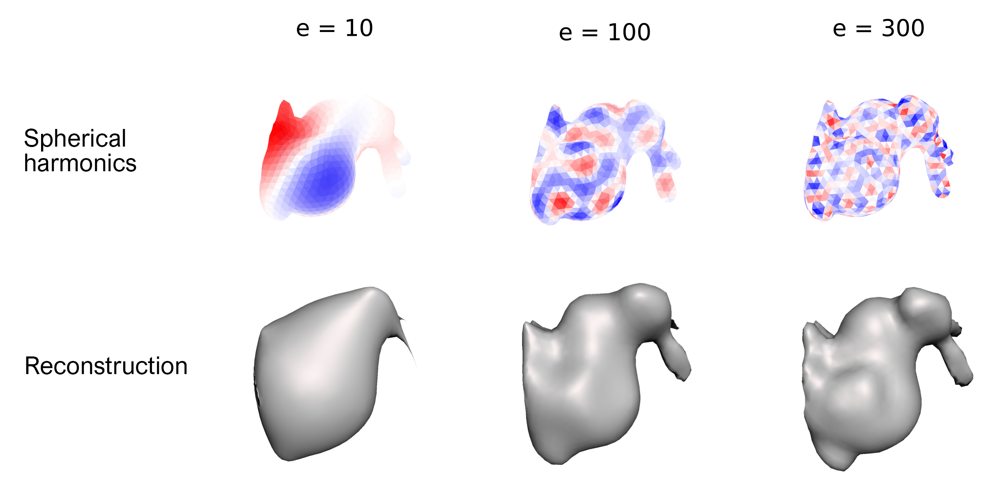

# LBOmeshfilter

Every surface mesh can be characterized by a combination of its most prominent frequency components, or surface harmonics. The Laplace-Beltrami operator, is a discretized method to determine the surface harmonics at each vertex. 

LBOmeshfilter allows reconstruction of a 3D surface mesh using the first n eigenvectors, which can be useful for different mesh processing tasks. When all eigenvectors are used for reconstruction, the original mesh is generated. 

## Installation and usage
Project is created with:
* Python version: 3.8.5

To run this project:
1. Create and/or load a virtual environment (optional) 
```
conda create -n yourenvname python=3.8
conda activate yourenvname
```
2. Clone repository
```
git clone https://github.com/T-AbdelAlim/LBOmeshfilter.git
cd LBOmeshfilter
```
4. Install requirements
```
pip install -r requirements.txt
```

5. Run examples --> (results saved in ```/examples/results```)
```
python test.py
```


